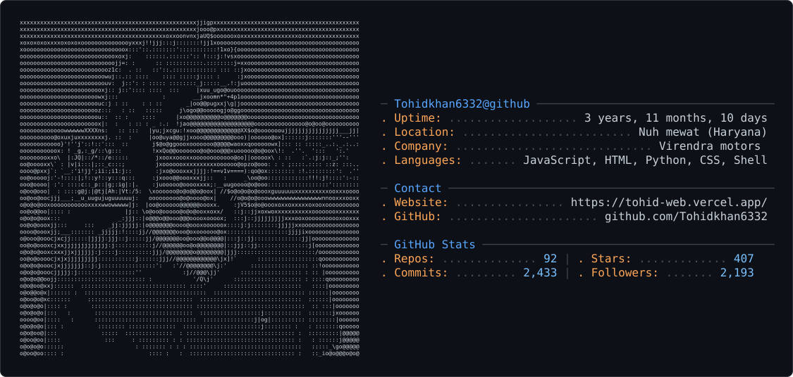

<p align="center">
  
</p>

[](https://github.com/Tohidkhan6332)


<h1 align="center">Hi 👋, I'm Tohid Khan</h1>
<h3 align="center">Developer • Automation Builder • WhatsApp & AI Projects</h3>

<p align="center">
  <a href="https://github.com/Tohidkhan6332?tab=repositories">
    
  </a>
  <a href="https://github.com/Tohidkhan6332/TOHID-AGENT">
    
  </a>
  <a href="mailto:tohidkhan9050482152@gmail.com">
    
  </a>
</p>

## 📊 My GitHub Stats

<p align="center">
  
  
</p>

<p align="center">
  <a href="https://github.com/Tohidkhan6332">
    
  </a>
  <a href="https://github-profile-summary-cards.vercel.app/api/cards/productive-time?username=Tohidkhan6332&theme=github_dark&utcOffset=5.5">
    
  </a>
</p>

<p align="center">
  <a href="https://github.com/DenverCoder1/readme-typing-svg">
    
  </a>
</p>


## 🧩 What I Build

<p align="center">
  
  
  
  
</p>

<p align="center">
  
  
  
  
</p>

## 🚀 Currently Working On

<p align="center">
  <a href="https://github.com/Tohidkhan6332/TOHID-AI">
    
  </a>
  <a href="https://github.com/Tohidkhan6332/TOHID-AGENT">
    
  </a>
</p>

- 📄 Know about my [experiences](https://github.com/Tohidkhan6332?tab=repositories)

- 👯 I’m looking to collaborate on **JavaScript projects**

- 🌱 Fun fact **I always wear my favorite pair of quirky socks while programming 😂**

---

## 📊 Languages and Tools


## 💻 Developer Profile

```js
const tohid = {
  role: "Developer",
  location: "Haryana, India",
  languages: ["JavaScript", "Python", "HTML", "CSS"],
  backend: ["Node.js", "Express.js", "REST APIs"],
  frontend: ["React", "HTML5", "CSS3"],
  databases: ["MongoDB", "MySQL", "SQL Server"],
  automation: ["WhatsApp Bots", "AI Automation", "API Integrations"],
  tools: ["Git", "GitHub", "Docker", "VS Code", "Linux"],
  deployment: ["Vercel", "Render", "Docker", "VPS"],
  currentlyBuilding: ["TOHID-AGENT", "TOHID-AI"]
};
```

### 🧠 Coding & Development

- **JavaScript / Node.js** — bot development, REST APIs, automation and backend services
- **Python** — scripting, automation and utility tools
- **React** — frontend interfaces and dashboards
- **MongoDB** — application data, users, groups and bot-related persistence
- **Git & GitHub** — version control, repositories and project workflows
- **Docker / VPS** — deployment, services and production environments
- **API Integration** — connecting AI, messaging, web and third-party services

### ⚙️ Typical Project Flow

```text
Idea
  ↓
Architecture & File Structure
  ↓
JavaScript / Python Development
  ↓
API + Database Integration
  ↓
Testing & Debugging
  ↓
Git / GitHub
  ↓
Docker / VPS / Cloud Deployment
```

## 🎯 Focus Areas

- 🤖 **AI & Automation** — practical AI-powered tools and workflow automation
- 💬 **WhatsApp Development** — bots, pairing systems and messaging automation
- 🌐 **Web Development** — responsive websites, dashboards and developer tools
- 🧰 **Backend Development** — Node.js, APIs, databases and deployment workflows
- 🐍 **Python & JavaScript** — scripting, web development and automation

## 👤 About Me

I'm Tohid Khan, a developer from Haryana, India, focused on JavaScript, Python, web development, automation, and WhatsApp/AI projects.

## 🔗 Quick Navigation

<p align="center">
  <a href="#-what-i-build"></a>
  <a href="#-my-github-stats"></a>
  <a href="#-featured-projects"></a>
  <a href="#-connect-with-me"></a>
</p>

<a href="https://github.com/Tohidkhan6332?tab=repositories">
  
</a>

<a href="https://github.com/Tohidkhan6332/TOHID-INFO">
  
</a>

---

# `🛠 My Stacks`
> ### Programming Languages
  
<div>

</div>

<div>


</div>


> ### Techs, Frameworks & Tools

<div>
  
</div>


<div>
  
  
</div>


<div>
  

  
   
  
</div>

  <!--  -->

<div>
  
  <!--  -->
  
</div>


<div>
   
  
  <!--  -->
  
</div>


  <!-- 

  

  

   -->

<p align="left"> 
  <a href="https://angular.io" target="_blank" rel="noreferrer"> 
    
  </a> 
  
  <a href="https://aws.amazon.com" target="_blank" rel="noreferrer"> 
  
  </a> 
  
  <a href="https://azure.microsoft.com/en-in/" target="_blank" rel="noreferrer"> 
    
  </a> 
  <a href="https://getbootstrap.com" target="_blank" rel="noreferrer">  </a> <a href="https://www.cprogramming.com/" target="_blank" rel="noreferrer">  </a> <a href="https://canvasjs.com" target="_blank" rel="noreferrer">  </a> <a href="https://www.w3schools.com/cpp/" target="_blank" rel="noreferrer">  </a> <a href="https://www.w3schools.com/cs/" target="_blank" rel="noreferrer">  </a> <a href="https://www.w3schools.com/css/" target="_blank" rel="noreferrer">  </a> <a href="https://www.docker.com/" target="_blank" rel="noreferrer">  </a> <a href="https://dotnet.microsoft.com/" target="_blank" rel="noreferrer">  </a> <a href="https://www.figma.com/" target="_blank" rel="noreferrer">  </a> <a href="https://firebase.google.com/" target="_blank" rel="noreferrer">  </a> <a href="https://www.w3.org/html/" target="_blank" rel="noreferrer">  </a> <a href="https://www.adobe.com/in/products/illustrator.html" target="_blank" rel="noreferrer">  </a> <a href="https://developer.mozilla.org/en-US/docs/Web/JavaScript" target="_blank" rel="noreferrer">  </a> 

  <a href="https://www.linux.org/" target="_blank" rel="noreferrer"> 
     
  </a>

   <a href="https://www.mathworks.com/" target="_blank" rel="noreferrer">  </a> <a href="https://www.mongodb.com/" target="_blank" rel="noreferrer">  </a> <a href="https://www.microsoft.com/en-us/sql-server" target="_blank" rel="noreferrer">  </a> <a href="https://www.mysql.com/" target="_blank" rel="noreferrer">  </a> <a href="https://www.photoshop.com/en" target="_blank" rel="noreferrer">  </a> <a href="https://www.selenium.dev" target="_blank" rel="noreferrer">  </a> <a href="https://unity.com/" target="_blank" rel="noreferrer">  </a> 
    <a href="https://zapier.com" target="_blank" rel="noreferrer"> 
      
    </a> 
  
  </p>


---

<a></a>
<a></a>

## 🚀 Featured Projects

<p align="center">
  <a href="https://github.com/Tohidkhan6332/TOHID-AGENT">
    
  </a>
  <a href="https://github.com/Tohidkhan6332/TOHID-AI">
    
  </a>
</p>

<p align="center">
  <a href="https://github.com/Tohidkhan6332/Tohid-Ai-Quiz-Bot">
    
  </a>
  <a href="https://github.com/Tohidkhan6332/tohidgame">
    
  </a>
</p>

<p align="center">
  <a href="https://github.com/Tohidkhan6332/tohidgeminiprompte">
    
  </a>
  <a href="https://github.com/Tohidkhan6332/TOHID-AI-WEB-PAIR">
    
  </a>
</p>

<p align="center">
  <a href="https://github.com/Tohidkhan6332?tab=repositories">
    
  </a>
</p>

## 📬 Connect With Me

<p align="center">
  <a href="mailto:tohidkhan9050482152@gmail.com">
    
  </a>
  <a href="https://instagram.com/Tohidkhan6332">
    
  </a>
  <a href="https://t.me/Tohidkhan6332">
    
  </a>
  <a href="https://wa.me/917849917350?text=Hello%20Tohid">
    
  </a>
</p>

<p align="center">
  <a href="https://github.com/Tohidkhan6332">
    
  </a>
  <a href="https://github.com/Tohidkhan6332/TOHID-INFO">
    
  </a>
</p>

---

<p align="center">
  <b>Thanks for visiting my profile! 🚀</b><br>
  <sub>Building bots, web apps, automation tools and AI projects.</sub>
</p>
